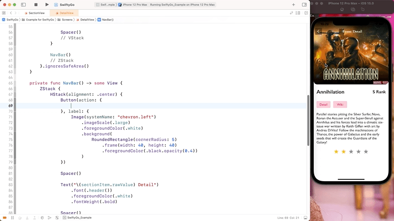

<a href="https://www.simform.com/"></a>

SSSwiftyGo
=============
[](https://cocoapods.org/pods/SwiftyGo)
[](https://cocoapods.org/pods/SwiftyGo)
[](https://cocoapods.org/pods/SwiftyGo)
[![Swift Version][swift-image]][swift-url]
[![PRs Welcome][PR-image]][PR-url]
[](https://twitter.com/simform)

SSSwiftyGo is written in Swift to help you to navigate in SwiftUI Views using only one line of code.

Setup Instructions
------------------
[CocoaPods](http://cocoapods.org)
------------------
To integrate SSMediaLibrary into your Xcode project using CocoaPods, specify it in your `Podfile`:
```ruby
pod 'SwiftyGo'
```
and in your code add `import SwiftyGo`.

[Swift Package Manager](https://swift.org/package-manager/)
------------------
When using Xcode 11 or later, you can install `SSSwiftyGo` by going to your Project settings > `Swift Packages` and add the repository by providing the GitHub URL. Alternatively, you can go to `File` > `Swift Packages` > `Add Package Dependencies...`

## Manually

1. Add `MainCoordinator.swift` and `NavigationProtocol.swift` to your project.
2. Grab yourself a cold 🍺.

## Requirements
* iOS 13+
* Xcode 11+

# Usage

Initial Setup
---------
```swift
func scene(_ scene: UIScene, willConnectTo session: UISceneSession, options connectionOptions: UIScene.ConnectionOptions) {

        let contentView = ContentView()
        Coordinator.initialize(view: contentView)
        
        if let windowScene = scene as? UIWindowScene {
            let window = UIWindow(windowScene: windowScene)
            window.rootViewController = Coordinator.rootView
            self.window = window
            window.makeKeyAndVisible()
        }
    }
```
Navigate To Next
----------------
&nbsp;&nbsp;&nbsp;&nbsp;&nbsp;

Pop To Previous
---------------
&nbsp;&nbsp;&nbsp;&nbsp;&nbsp;

# Check out our other Libraries

<h3><a href="https://github.com/SimformSolutionsPvtLtd"><u>🗂 Simform Solutions Libraries→</u></a></h3>


## MIT License

Copyright (c) 2021 Simform Solutions

Permission is hereby granted, free of charge, to any person obtaining a copy
of this software and associated documentation files (the "Software"), to deal
in the Software without restriction, including without limitation the rights
to use, copy, modify, merge, publish, distribute, sublicense, and/or sell
copies of the Software, and to permit persons to whom the Software is
furnished to do so, subject to the following conditions:

The above copyright notice and this permission notice shall be included in all
copies or substantial portions of the Software.

THE SOFTWARE IS PROVIDED "AS IS", WITHOUT WARRANTY OF ANY KIND, EXPRESS OR
IMPLIED, INCLUDING BUT NOT LIMITED TO THE WARRANTIES OF MERCHANTABILITY,
FITNESS FOR A PARTICULAR PURPOSE AND NONINFRINGEMENT. IN NO EVENT SHALL THE
AUTHORS OR COPYRIGHT HOLDERS BE LIABLE FOR ANY CLAIM, DAMAGES, OR OTHER
LIABILITY, WHETHER IN AN ACTION OF CONTRACT, TORT OR OTHERWISE, ARISING FROM,
OUT OF OR IN CONNECTION WITH THE SOFTWARE OR THE USE OR OTHER DEALINGS IN THE
SOFTWARE.

[PR-image]:https://img.shields.io/badge/PRs-welcome-brightgreen.svg?style=flat
[PR-url]:http://makeapullrequest.com
[swift-image]:https://img.shields.io/badge/swift-5.0-orange.svg
[swift-url]: https://swift.org/
